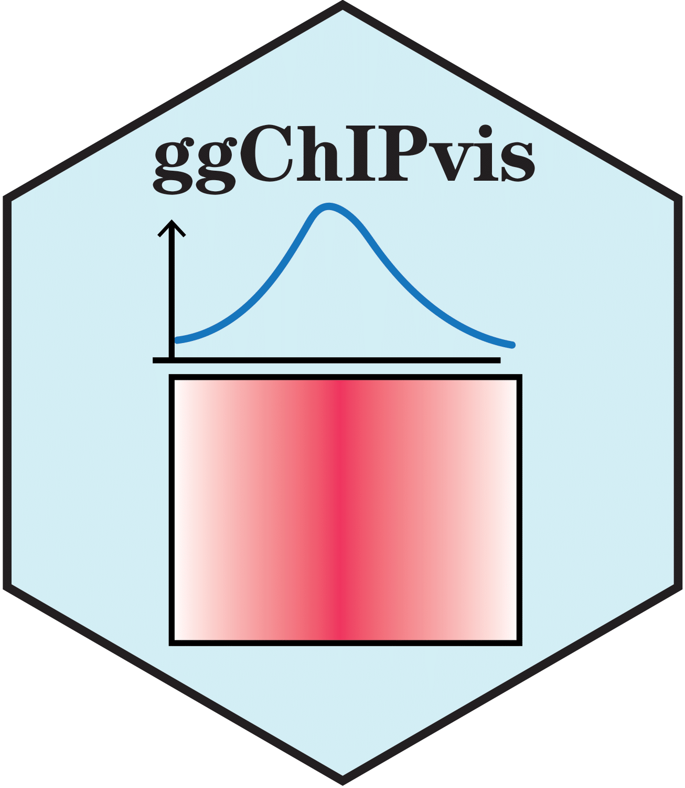

# ggChIPvis 

<!-- badges: start -->

**ggChIPvis** is designed to re-produce the ***Profile*** and ***Heatmap*** plots uisng
**ggplot2** package with more parameter controls and settings. **ggChIPvis** can accept
the data from **EnrichedHeatmap::normalizeToMatrix**, **ChIPseeker::getTagMatrix** and deeptools'
**computeMatrix** output data which allow you re-draw the plot in R session with other
graphic modifications.

<!-- badges: end -->

## Installation

You can install the development version of ggChIPvis like so:

``` r
# install.packages("devtools")
devtools::install_github("junjunlab/ggChIPvis")

# or
remotes::install_github("junjunlab/ggChIPvis")
library(ggChIPvis)
```

## Citation

> Jun Zhang (2023). *ggChIPvis: Profile and Heatmap Visualization by Using ggplot2.*  https://github.com/junjunlab/ggChIPvis

## Documentation

> ***[https://junjunlab.github.io/ggChIPvis-manual/](https://junjunlab.github.io/ggChIPvis-manual/)***

